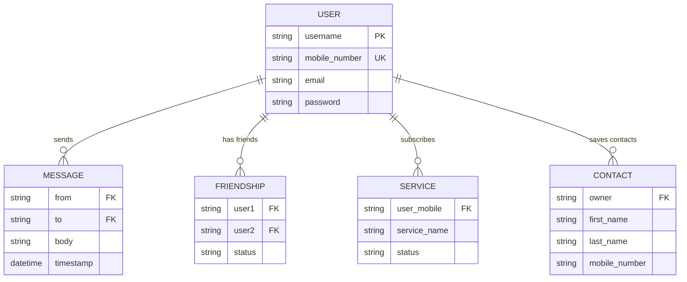

# Project Report: Online SMS Site

## 1. Problem Definition
The project aims to develop a synchronous e-learning and implementation environment where students can build a robust, real-world application. Specifically, the "Online SMS Site" addresses the need for a simplified communication platform that allows users to send SMS, manage social connections, and subscribe to value-added services (VAS).

## 2. Customer Requirement Specification (CRS)
- **User Authentication**: Mandatory registration with unique mobile numbers and username validation. 
- **Validation**: Mobile numbers must be exactly 10 digits and unique per account.
- **Messaging Rules**: 
  * Max 120 characters per message.
  * 5 free messages for non-friend numbers.
  * Unlimited free messages for registered friends.
- **Profile Management**: Dual profile sections (Personal and Professional).
- **Value Added Services**: Paid subscription for Jokes, News, Sports, etc., via Credit Card.
- **Architecture**: Minimal Pentium 166 hardware support, responsive modern interface.

## 3. GUI Standards Document
The interface adheres to high-end modern design standards:
- **Design Style**: Glassmorphism (Frosted glass effects).
- **Color Palette**: Deep Indigo (#6366f1) and Neon Purple (#a855f7).
- **Typography**: Outfit font for readability and modern feel.
- **Feedback**: Dynamic success/error alerts and real-time character counters.
- **Navigation**: Persistent, blur-based sticky navbar for fast navigation.

## 4. E-R Diagram

## 5. Implementation Summary
- **Frontend**: Structured HTML5 with SPA-style dynamic view injection.
- **Styling**: Vanilla CSS3 using custom properties and backdrop filters.
- **State**: Client-side state orchestration using `localStorage` for cross-session persistence.
- **Validation**: Client-side JS validation for unique mobile, character lengths, and friend limits.
- **Contacts**: Dedicated View for managing personal contacts with a Quick-Picker integrated into the messaging suite.

## 6. Certificate of Completion
The project meets all functional and technical criteria defined in the initial problem statement.
- [x] Registration System
- [x] Profile Management
- [x] Messaging Engine (Limit Enforcement)
- [x] Friend Suggestion & Request System
- [x] Payment Simulation & Service Activation
